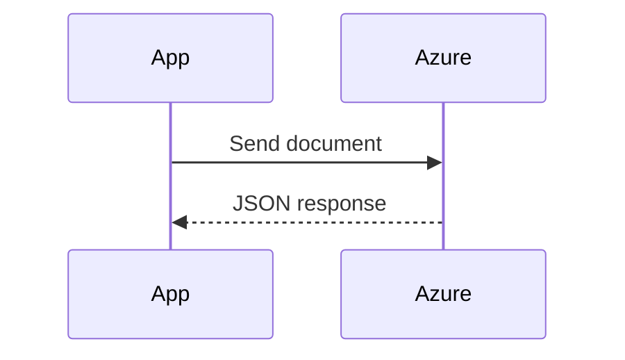

## built in functions
```js
// regex match
str.match(/[a-z']/i);
// to lower/upper
.toLowerCase()
// split
.split('')
.filter()
.map()
// reduce
words.reduce((p, c) => { ... })
```
## array from object properties
```js
let arr = Object.keys(counts).map(k => {
    return {count: counts[k], char: k}; });
```
## human duration time
```js
function formatDuration (seconds) {
  if(seconds == 0) return 'now';
  let result = [];
  const words = ['year','day','hour','minute','second'];
  const values = [365*24*3600, 24*3600,3600,60,1];
  for(let i = 0; i<5; i++){
    const n = Math.floor(seconds/values[i]);
    seconds = seconds % values[i];
    if(n > 0){
      result.push(`${n} ${words[i]}${n > 1 ? 's' : ''}`);
    }
  }
  return result.length <= 2
    ? result.join(" and ")
    : result.slice(0,result.length - 1).join(", ") + ` and ${result[result.length-1]}`;
}
```

# Azure Form Recognizer + .NET
Learn how to send PDFs to Azure Form Recognizer and extract data.
